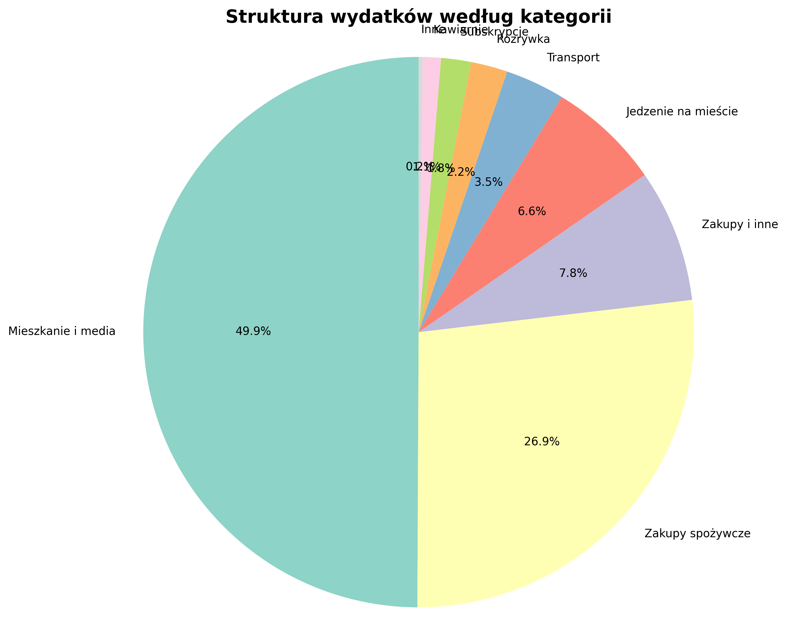

# Personal Finance Automator - Analiza Wydatków Studenckich

## 📊 O Projekcie

**Personal Finance Automator** to narzędzie analityczne stworzone w Pythonie, które automatyzuje proces analizy osobistych finansów. System przetwarza dane transakcyjne w formacie CSV, kategoryzuje wydatki przy użyciu algorytmów pattern matching i generuje kompleksowe raporty finansowe wraz z wizualizacjami.

Projekt powstał jako odpowiedź na rzeczywiste wyzwanie związane z zarządzaniem budżetem studenckim i stanowi praktyczne zastosowanie technik data engineering oraz analizy danych.

---

## 🎯 Problem

### Analiza sytuacji wyjściowej

Studenci w Polsce często borykają się z następującymi problemami finansowymi:

- **Brak przejrzystości przepływów finansowych** - trudność w śledzeniu, na co dokładnie wydawane są pieniądze
- **Rosnący debet na koncie** - systematyczny spadek salda bez jasnego zrozumienia przyczyn
- **Brak narzędzi analitycznych** - aplikacje bankowe oferują podstawowe zestawienia, ale nie dostarczają głębszej analizy i kategoryzacji
- **Czasochłonność ręcznej analizy** - manualne przeglądanie setek transakcji w poszukiwaniu wzorców jest nieefektywne

### Konsekwencje

Brak kontroli nad wydatkami prowadzi do:
- Niezdrowych nawyków finansowych
- Stresu związanego z brakiem oszczędności
- Niemożności planowania większych zakupów
- Uzależnienia od wsparcia finansowego rodziny

---

## 💡 Rozwiązanie

### Architektura systemu

System składa się z trzech głównych modułów:

#### 1. Moduł wczytywania danych
- Import danych z plików CSV
- Walidacja i parsowanie dat
- Konwersja typów danych dla operacji numerycznych

#### 2. Moduł klasyfikacji transakcji
```python
def kategoryzuj(opis, kwota):
    # Inteligentna kategoryzacja oparta na analizie wzorców
    # - Zakupy spożywcze (Biedronka, Lidl, Kaufland, Żabka)
    # - Mieszkanie i media (czynsz, prąd, opłaty)
    # - Transport (MPK, Uber, Bolt)
    # - Subskrypcje (Netflix, Spotify)
    # - Jedzenie na mieście (restauracje, fast-food)
    # - Rozrywka (kino, wydarzenia)
    # - Pozostałe kategorie
```

Algorytm wykorzystuje:
- **Pattern matching** dla rozpoznawania nazw sklepów i usług
- **Keyword detection** dla identyfikacji kategorii wydatków
- **Fallback mechanism** dla nietypowych transakcji

#### 3. Moduł wizualizacji i raportowania
- Generowanie wykresów kołowych (pie charts) pokazujących strukturę wydatków
- Obliczanie kluczowych wskaźników finansowych
- Export wyników w formacie tekstowym i graficznym

### Technologie

- **Python 3.11+** - język programowania
- **Pandas** - przetwarzanie i analiza danych
- **Matplotlib** - wizualizacja danych

---

## 📈 Wyniki

### Kluczowe odkrycia

Po uruchomieniu analizy dla zestawu 100 transakcji z 3-miesięcznego okresu (październik 2025 - styczeń 2026), system wykrył:

#### 🚨 Zidentyfikowana dziura budżetowa: **-3,001.68 PLN**

| Metryka | Wartość |
|---------|---------|
| Całkowite wpływy | 4,900.00 PLN |
| Całkowite wydatki | 7,901.68 PLN |
| **Deficyt** | **-3,001.68 PLN** |

### Struktura wydatków

System automatycznie skategoryzował wszystkie transakcje i zidentyfikował główne obszary wydatków:

| Kategoria | Kwota | Udział |
|-----------|-------|--------|
| 🏠 **Mieszkanie i media** | **-3,945.00 PLN** | **49.9%** |
| 🛒 Zakupy spożywcze | -2,129.20 PLN | 26.9% |
| 🛍️ Zakupy i inne | -616.30 PLN | 7.8% |
| 🍕 Jedzenie na mieście | -524.00 PLN | 6.6% |
| 🚌 Transport | -275.50 PLN | 3.5% |
| 🎬 Rozrywka | -170.00 PLN | 2.2% |
| 📺 Subskrypcje | -138.98 PLN | 1.8% |
| ☕ Kawiarnie | -83.20 PLN | 1.1% |
| 🔧 Inne | -19.50 PLN | 0.2% |

### Wnioski analityczne

1. **Krytyczny koszt mieszkania**: Czynsz i media stanowią prawie **50% wszystkich wydatków**, co jest głównym czynnikiem deficytu budżetowego

2. **Potencjał optymalizacji**: Wydatki na jedzenie na mieście (524 PLN) i kawiarnie (83.20 PLN) razem stanowią **607.20 PLN** - obszar z największym potencjałem redukcji kosztów

3. **Zrównoważone zakupy**: Wydatki na zakupy spożywcze (2,129 PLN / 3 miesiące ≈ 710 PLN/miesiąc) są w rozsądnych granicach

4. **Subskrypcje pod kontrolą**: Koszty subskrypcji (Netflix, Spotify) stanowią zaledwie 1.8% wydatków

### Wizualizacja

System automatycznie generuje wykres kołowy (`wydatki_wykres.png`) prezentujący strukturę wydatków:



---

## 🚀 Instrukcja uruchomienia

### Wymagania systemowe

- Python 3.11 lub nowszy
- pip (menedżer pakietów Python)
- 50 MB wolnego miejsca na dysku

### Instalacja

#### Krok 1: Klonowanie repozytorium
```bash
git clone https://github.com/twoj-username/personal-finance-automator.git
cd personal-finance-automator
```

#### Krok 2: Instalacja zależności
```bash
pip install -r requirements.txt
```

### Uruchomienie

```bash
python main.py
```

### Oczekiwany output

```
============================================================
ANALIZA FINANSOWA - TRANSAKCJE STUDENCKIE
============================================================

SUMA WYDATKÓW DLA KAŻDEJ KATEGORII:
------------------------------------------------------------
Mieszkanie i media: -3945.00 zł
Zakupy spożywcze: -2129.20 zł
...

Generowanie wykresu...
Zapisano wykres: wydatki_wykres.png

============================================================
PODSUMOWANIE FINANSOWE
============================================================

Łącznie wydano:  7,901.68 zł
Łącznie wpłynęło: 4,900.00 zł
Bilans:           -3,001.68 zł
```

---

## 📁 Struktura projektu

```
projekt_finanse/
│
├── main.py                 # Główny skrypt analizy
├── transakcje.csv          # Dane wejściowe (przykładowe)
├── wydatki_wykres.png      # Wygenerowany wykres (output)
│
├── requirements.txt        # Zależności projektu
├── .gitignore             # Konfiguracja Git
└── README.md              # Dokumentacja
```

---

## 🔧 Dostosowanie do własnych danych

### Format pliku CSV

Plik `transakcje.csv` powinien mieć następującą strukturę:

```csv
Data,Opis_Transakcji,Kwota
2025-10-01,Biedronka,-45.30
2025-10-01,Przelew od rodzicow,800.00
```

**Kolumny:**
- `Data` - format YYYY-MM-DD
- `Opis_Transakcji` - opis transakcji (dowolny tekst)
- `Kwota` - wartość liczbowa (ujemna dla wydatków, dodatnia dla wpływów)

### Modyfikacja kategorii

Aby dostosować algorytm kategoryzacji do własnych potrzeb, edytuj funkcję `kategoryzuj()` w pliku `main.py:13-35`.

Przykład dodania nowej kategorii:

```python
elif any(slowo in opis for slowo in ['siłownia', 'fitness', 'gym']):
    return 'Sport i zdrowie'
```

---

## 📊 Możliwości rozwoju

Projekt stanowi fundament dla dalszych rozszerzeń:

- [ ] **Integracja z API banków** - automatyczny import transakcji
- [ ] **Machine Learning** - predykcja przyszłych wydatków
- [ ] **Dashboard webowy** - interfejs graficzny (Flask/Django)
- [ ] **Alerty budżetowe** - powiadomienia o przekroczeniu limitów
- [ ] **Eksport do PDF** - profesjonalne raporty finansowe
- [ ] **Analiza trendów** - wykrywanie wzorców w dłuższych okresach
- [ ] **Porównanie międzyokresowe** - analiza M-o-M, Y-o-Y

---

## 🎓 Kompetencje techniczne

Projekt demonstruje następujące umiejętności:

- **Data Engineering** - ETL (Extract, Transform, Load), czyszczenie danych
- **Analiza danych** - agregacje, grupowanie, obliczenia statystyczne
- **Wizualizacja danych** - tworzenie czytelnych wykresów
- **Python best practices** - clean code, funkcje, modularność
- **Git & GitHub** - wersjonowanie kodu, dokumentacja
- **Problem solving** - identyfikacja problemu biznesowego i jego rozwiązanie

---

## 📝 Licencja

Projekt jest dostępny na licencji MIT - szczegóły w pliku `LICENSE`.

---

## 👤 Autor

**Filip** - Data Engineer / Python Developer

💼 [LinkedIn](https://linkedin.com/in/twoj-profil) | 🐱 [GitHub](https://github.com/twoj-username) | 📧 kontakt@email.com

---

## 🙏 Podziękowania

Projekt powstał jako praktyczne narzędzie do zarządzania finansami osobistymi i demonstracja umiejętności analizy danych w kontekście rzeczywistych problemów biznesowych.

---

**⭐ Jeśli projekt Ci się podoba, zostaw gwiazdkę na GitHub!**
